### 1 - Buscar o nome e ano dos filmes
``` SQL
SELECT
    Nome,
    Ano
FROM
    Filmes;
```

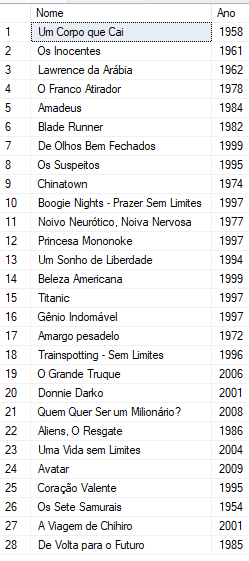

### 2 - Buscar o nome e ano dos filmes, ordenados por ordem crescente pelo ano
``` SQL
SELECT
    Nome,
    Ano
FROM
    Filmes
ORDER BY
    Ano
```
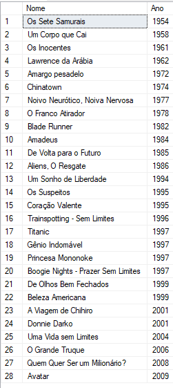

### 3 - Buscar pelo filme de volta para o futuro, trazendo o nome, ano e a duração
``` SQL
SELECT
    *
FROM
    Filmes
WHERE
    Nome = 'De Volta para o Futuro'
```
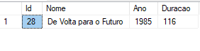

### 4 - Buscar os filmes lançados em 1997
``` SQL
SELECT
    *
FROM
    Filmes
WHERE
    Ano = 1997
```
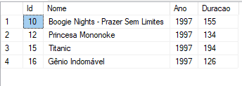

### 5 - Buscar os filmes lançados APÓS o ano 2000
``` SQL
SELECT
    *
FROM
    Filmes
WHERE
    Ano > 2000
```
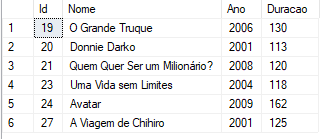

### 6 - Buscar os filmes com a duracao maior que 100 e menor que 150, ordenando pela duracao em ordem crescente
``` SQL
SELECT
    *
FROM
    Filmes
WHERE
    Duracao > 100
    AND Duracao < 150
ORDER BY
    Duracao
```
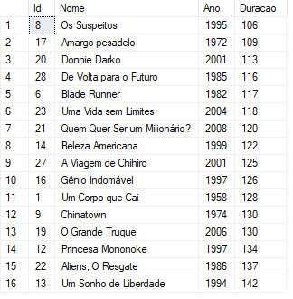


### 7 - Buscar a quantidade de filmes lançadas no ano, agrupando por ano, ordenando pela quantidade em ordem decrescente
``` SQL
SELECT
    Ano,
    Count(*) AS Quantidade
From
    Filmes
GROUP BY
    Ano
ORDER BY
    Quantidade DESC
```
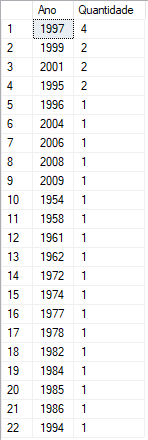

### 8 - Buscar os Atores do gênero masculino, retornando o PrimeiroNome, UltimoNome
``` SQL
SELECT
    PrimeiroNome,
    UltimoNome
FROM
    Atores
WHERE
    Genero = 'M'
```
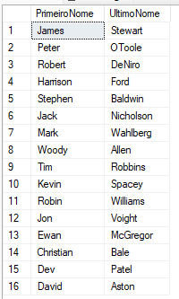

### 9 - Buscar os Atores do gênero feminino, retornando o PrimeiroNome, UltimoNome, e ordenando pelo PrimeiroNome
``` SQL
SELECT
    PrimeiroNome,
    UltimoNome
FROM
    Atores
WHERE
    Genero = 'F'
ORDER BY
    PrimeiroNome
```
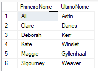

### 10 - Buscar o nome do filme e o gênero
``` SQL
SELECT
    Nome,
    Generos.Genero
FROM
    Filmes
    INNER JOIN FilmesGenero ON Filmes.Id = FilmesGenero.IdFilme
    INNER JOIN Generos ON FilmesGenero.IdGenero = Generos.Id
```
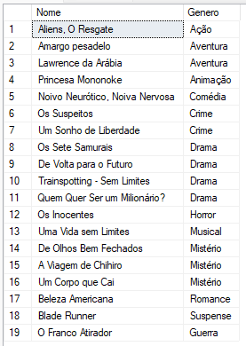


### 11 - Buscar o nome do filme e o gênero do tipo "Mistério"
``` SQL
SELECT
    Nome,
    Generos.Genero AS Genero
FROM
    Filmes
    INNER JOIN FilmesGenero ON Filmes.Id = FilmesGenero.IdFilme
    INNER JOIN Generos ON FilmesGenero.IdGenero = Generos.Id
WHERE
    Genero = 'Mistério'
```


### 12 - Buscar o nome do filme e os atores, trazendo o PrimeiroNome, UltimoNome e seu Papel
``` SQL
SELECT
    Nome,
    Atores.PrimeiroNome,
    Atores.UltimoNome,
    ElencoFilme.Papel
FROM
    Filmes
    INNER JOIN ElencoFilme ON Filmes.Id = ElencoFilme.IdFilme
    INNER JOIN Atores ON ElencoFilme.IdAtor = Atores.Id
```
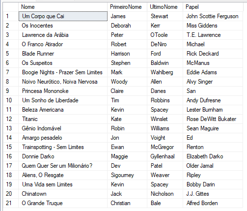